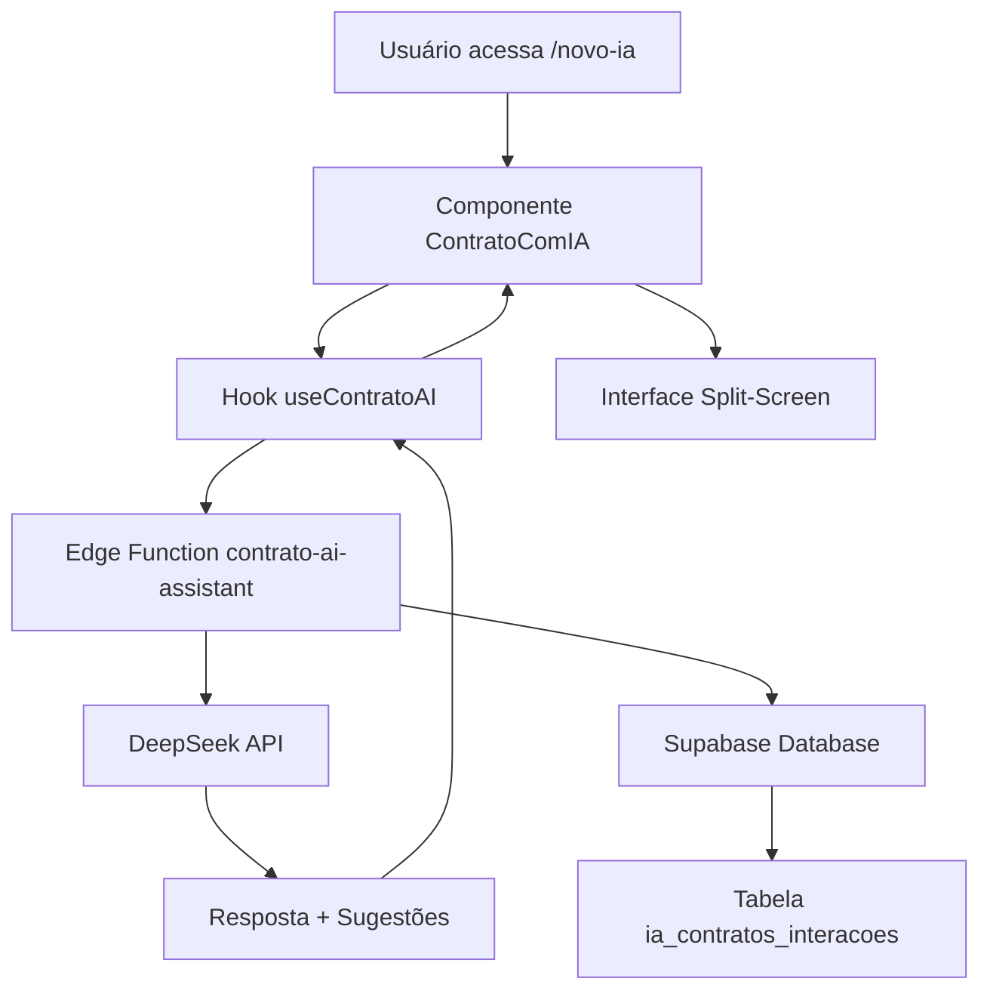
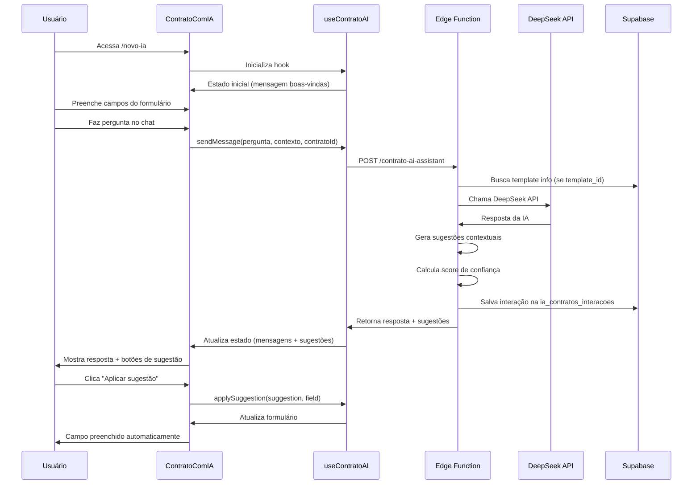

# 📋 ObrasAI 2.2 - Product Requirements Document (PRD)

## 🎯 VISÃO GERAL DO PRODUTO

### Produto

**ObrasAI** - Plataforma Inteligente para Gestão de Obras na Construção Civil

### Versão

**2.2** (Janeiro 2025)

### Missão

Revolucionar a gestão de obras na construção civil brasileira através de
tecnologia avançada, inteligência artificial especializada e automação de
processos, proporcionando controle total de custos, cronogramas e recursos.

### Visão

Ser a plataforma líder em gestão de obras no Brasil, reconhecida pela qualidade
técnica, inovação em IA e impacto na produtividade do setor de construção civil.

## 📊 STATUS DE IMPLEMENTAÇÃO

### ✅ MÓDULOS 100% IMPLEMENTADOS E FUNCIONAIS

#### 🏗️ M01 - GESTÃO DE OBRAS E CADASTROS

**Status: ✅ COMPLETO**

**Funcionalidades Implementadas:**

- ✅ **CRUD de Obras**: Sistema completo com validação de datas, orçamento,
  endereços, integração com fornecedores, contratos e despesas
- ✅ **Gestão de Fornecedores PJ/PF**: CRUD com validação de CNPJ, razão social,
  CPF, RG, integração com contratos e obras
- ✅ **Sistema de Despesas**: Categorização por 21 etapas e 150+ insumos da
  construção civil, integração com obras e relatórios
- ✅ **Gestão de Notas Fiscais**: Upload de arquivos, Supabase Storage
  integrado, processamento automático, integração com obras e dashboard
- ✅ **Dashboard Executivo**: Métricas em tempo real, KPIs consolidados, filtros
  avançados, exportação

**Tecnologias:**

- React 18.3.1 + TypeScript 5.6.2
- TanStack Query para state management
- React Hook Form + Zod para validação
- Supabase PostgreSQL com RLS (Row Level Security)
- Tailwind CSS + Shadcn/UI

#### 🤖 M02 - INTELIGÊNCIA ARTIFICIAL ESPECIALIZADA

**Status: ✅ COMPLETO**

**Funcionalidades Implementadas:**

- ✅ **Chat Contextual**: IA com acesso aos dados reais das obras do usuário
- ✅ **Análise Financeira**: Comparação orçamento vs gastos reais
- ✅ **Sugestões Inteligentes**: Baseadas em dados históricos da obra
- ✅ **Conhecimento Técnico**: Especializada em construção civil brasileira
- ✅ **Rate Limiting**: 10 requests/minuto para segurança
- ✅ **Edge Functions**: Integração DeepSeek API, prompts especializados,
  logging, analytics

**Edge Function Implementada:**

```typescript
// supabase/functions/ai-chat/index.ts
- DeepSeek API integrada
- Contexto PRD completo
- Rate limiting por usuário
- Segurança robusta
```

#### 🎯 M03 - SISTEMA DE CAPTURA DE LEADS

**Status: ✅ COMPLETO E FUNCIONAL**

**Chatbot Landing Page:**

- ✅ **Interface Conversacional**: React + Framer Motion
- ✅ **Fluxo Estruturado**: Nome → Email → Telefone → Empresa → Cargo →
  Interesse
- ✅ **Validação em Tempo Real**: Email, campos obrigatórios
- ✅ **IA Pós-captura**: Chat inteligente após coleta de dados
- ✅ **Design Responsivo**: Mobile-first
- ✅ **Integração n8n**: Workflow linear (Webhook, Preparar Dados, Google
  Sheets, Supabase, Gmail)
- ✅ **Tabela Leads**: Estrutura robusta, origem rastreável, integração com
  analytics

**Tabela de Leads (Supabase):**

```sql
-- 20241226_create_leads_table.sql
CREATE TABLE leads (
  id UUID PRIMARY KEY DEFAULT gen_random_uuid(),
  email TEXT NOT NULL,
  nome TEXT,
  telefone TEXT,
  empresa TEXT,
  cargo TEXT,
  interesse_nivel TEXT,
  origem TEXT DEFAULT 'chatbot',
  created_at TIMESTAMPTZ DEFAULT now(),
  updated_at TIMESTAMPTZ DEFAULT now()
);
```

#### 💰 M04 - ORÇAMENTO PARAMÉTRICO COM IA

**Status: ✅ COMPLETO**

**Funcionalidades Implementadas:**

- ✅ **Cálculo Automático**: IA analisa parâmetros e gera orçamentos
- ✅ **Base SINAPI**: Integração com preços oficiais, atualização automática
- ✅ **Cobertura Nacional**: Dados regionais atualizados
- ✅ **Parâmetros Personalizáveis**: Por tipo de obra
- ✅ **Relatórios Detalhados**: Histórico, análises, exportação
- ✅ **Edge Functions**: Geração de orçamento, integração com IA, relatórios

#### 🔍 M05 - SISTEMA SINAPI INTEGRADO

**Status: ✅ COMPLETO**

**Funcionalidades Implementadas:**

- ✅ **Consulta Inteligente**: Busca semântica de códigos SINAPI
- ✅ **Preços Atualizados**: Base oficial constantemente atualizada
- ✅ **Histórico de Consultas**: Por usuário logado
- ✅ **Integração**: Com sistema de orçamento, relatórios, analytics
- ✅ **Edge Functions**: Busca semântica, notificações, manutenção de preços

#### 💳 M06 - SISTEMA DE ASSINATURAS

**Status: ✅ COMPLETO**

**Planos Implementados:**

- ✅ **Básico**: R$ 97/mês - 5 obras, 1 usuário, 100 IA requests
- ✅ **Profissional**: R$ 197/mês - 20 obras, 5 usuários, 500 IA requests
- ✅ **Empresarial**: R$ 497/mês - Ilimitado + suporte prioritário

**Integração Stripe:**

- ✅ Webhooks configurados
- ✅ Controle de limites por plano
- ✅ Interface de upgrade/downgrade
- ✅ Edge Functions: Webhook, customer portal, checkout session

#### 📊 M07 - RELATÓRIOS E DASHBOARDS

**Status: ✅ COMPLETO**

**Funcionalidades Implementadas:**

- ✅ **Dashboard Principal**: Métricas consolidadas em tempo real
- ✅ **Listagens Avançadas**: Filtros, busca, paginação
- ✅ **Relatórios Básicos**: Obras, despesas, notas fiscais, contratos
- ✅ **Exportação**: Dados estruturados, integração com analytics

#### 📋 M09 - SISTEMA DE CONTRATOS INTELIGENTES COM IA

**Status: ✅ COMPLETO E FUNCIONAL**

**Funcionalidades Implementadas:**

- ✅ **Assistente IA Especializado em Contratos**: Edge Function
  `contrato-ai-assistant` (DeepSeek API, prompts técnicos, sugestões
  inteligentes, logging, analytics)
- ✅ **Interface Split-Screen**: Formulário + Chat IA em tempo real
- ✅ **Hook `useContratoAI`**: Gerenciamento completo do estado da IA,
  sugestões, feedback, histórico
- ✅ **Componente `ContratoComIA`**: Interface moderna, aplicação instantânea de
  sugestões
- ✅ **Tabela `ia_contratos_interacoes`**: Analytics, logging, métricas de
  performance, feedback
- ✅ **Rotas especializadas**: `/dashboard/contratos/novo-ia` e
  `/dashboard/contratos/:id/editar-ia`
- ✅ **CRUD Completo de Contratos**: Criação, listagem, edição, histórico,
  status
- ✅ **Templates Especializados**: Estrutura, Acabamento, Instalações,
  extensível
- ✅ **Geração Automática de Documentos**: HTML/PDF, hash SHA-256, upload
  Supabase Storage, preview
- ✅ **Assinatura Digital**: Envio por email, token único, expiração, validação,
  registro de IP
- ✅ **Gestão de Status**: RASCUNHO → AGUARDANDO → ATIVO → CONCLUÍDO
- ✅ **Segurança**: RLS, auditoria, isolamento multi-tenant
- ✅ **Integração Total**: Obras, fornecedores, analytics, relatórios

#### 🧠 **Especialização IA em Construção Civil**

- ✅ **Normas Técnicas**: NBR 15575, NBR 12721, NBR 8036, etc.
- ✅ **Legislação Brasileira**: Código Civil, CLT, CDC, Lei 8.666
- ✅ **Segurança do Trabalho**: NR-18 e demais normas regulamentadoras
- ✅ **Tipos de Contrato**: Empreitada, Fornecimento, Mão de obra, Mistos
- ✅ **Contexto Regional**: Aspectos climáticos e sazonais brasileiros
- ✅ **Responsabilidades Técnicas**: Materiais, equipamentos, supervisão

#### 💡 **Sistema de Sugestões Inteligentes**

- ✅ Geração automática baseada no contexto, tipo de pergunta e template
- ✅ Aplicação instantânea aos campos do formulário
- ✅ Score de confiança, justificativas técnicas, referências normativas
- ✅ Feedback do usuário, analytics de uso, melhoria contínua

#### 📈 **Analytics e Aprendizado de IA**

- ✅ Logging completo de interações
- ✅ Métricas de performance, taxa de aplicação, rating, tipos de perguntas
- ✅ Dashboard de analytics, filtros avançados, exportação

#### 🔗 **Integrações e Automação**

- ✅ n8n Cloud: Leads, Google Sheets, Email, Supabase
- ✅ Stripe: Planos, pagamentos, webhooks
- ✅ Google Sheets: Backup de leads
- ✅ Supabase Storage: Upload de documentos
- ✅ Gmail SMTP: Notificações e assinatura digital

### 📑 M10 - SISTEMA DE EMBEDDINGS DE DOCUMENTAÇÃO

**Status: ✅ COMPLETO**

**Funcionalidades Implementadas:**

- ✅ **Processamento de Documentos**: Split de arquivos Markdown/PDF em chunks
  via script Python `enviar_chunks_embeddings.py`.
- ✅ **Geração de Embeddings**: Edge Function `gerar-embeddings-documentacao`
  cria vetores com modelo `text-embedding-ada-002`.
- ✅ **Armazenamento Vetorial**: Embeddings e metadados salvos na tabela
  `embeddings_conhecimento` com `pgvector`.
- ✅ **Indexação e Busca Semântica**: Índices `ivfflat` para consultas similares
  em milissegundos.
- ✅ **Integração com IA**: Embeddings alimentam o chat contextual e futuras
  features de documentação inteligente.

**Edge Function Implementada:**

```typescript
// supabase/functions/gerar-embeddings-documentacao/index.ts
```

**Tabela de Banco de Dados:**

```sql
CREATE TABLE embeddings_conhecimento (
  id UUID PRIMARY KEY DEFAULT gen_random_uuid(),
  obra_id UUID,                     -- NULL para documentação geral / docs globais
  tipo_conteudo TEXT NOT NULL,      -- Ex: 'documentacao', 'despesas', 'contratos'
  referencia_id UUID NOT NULL,      -- ID do item original (ou UUID randômico para docs gerais)
  titulo TEXT NOT NULL,
  conteudo TEXT NOT NULL,
  conteudo_resumido TEXT,
  embedding VECTOR(1536),           -- Embedding OpenAI
  titulo_embedding VECTOR(1536),    -- Embedding do título
  metadata JSONB,
  created_at TIMESTAMPTZ DEFAULT now(),
  updated_at TIMESTAMPTZ DEFAULT now()
);
```

### 🏗️ M08 - ANÁLISE INTELIGENTE DE PLANTAS BAIXAS

**Status: 🔄 EM ROADMAP - Q1 2025**

**Funcionalidades Planejadas:**

- 🔄 **Upload de PDF**: Sistema de upload de plantas baixas em formato PDF
- 🔄 **Conversão Automática**: PDF → Imagem de alta resolução
- 🔄 **Vision AI Integration**: Análise automática com GPT-4 Vision ou Google
  Vision API
- 🔄 **Extração de Dados**: Identificação automática de cômodos, áreas e
  dimensões
- 🔄 **Cálculo de Materiais**: Estimativa automática baseada na metragem
- 🔄 **Orçamento Inteligente**: Integração com base SINAPI para custos por m²
- 🔄 **Insights de Engenharia**: Sugestões de melhorias e análise de viabilidade

**Implementação Técnica:**

```typescript
// Edge Function planejada
// supabase/functions/analyze-planta/index.ts
interface PlantaAnalysis {
  area_total: number;
  comodos: Array<{
    nome: string;
    area: number;
    dimensoes: string;
  }>;
  materiais_estimados: {
    ceramica: number;
    tinta: number;
    eletrica: number;
    hidraulica: number;
  };
  orcamento_estimado: number;
  insights_ia: string[];
}
```

**Fases de Implementação:**

- **Fase 1 (2-3 semanas)**: Upload PDF + conversão + análise básica
- **Fase 2 (3-4 semanas)**: Identificação de cômodos + cálculo de áreas
- **Fase 3 (2-3 semanas)**: Orçamento automático + insights IA

**Impacto no Negócio:**

- 🏆 **Diferencial ÚNICO**: Primeira plataforma com análise automática de
  plantas
- 💰 **Monetização**: Feature premium para planos Profissional/Empresarial
- 🚀 **Value Proposition**: Orçamento automático a partir de plantas baixas
- 🔥 **Barreira Competitiva**: Tecnologia avançada difícil de replicar

## 🛠️ STACK TECNOLÓGICA IMPLEMENTADA

### Frontend

```json
{
  "framework": "React 18.3.1",
  "language": "TypeScript 5.6.2",
  "build": "Vite 5.4.2",
  "ui": "Tailwind CSS + Shadcn/UI",
  "routing": "React Router DOM",
  "state": "TanStack Query",
  "forms": "React Hook Form + Zod",
  "animations": "Framer Motion"
}
```

### Backend & Infraestrutura

```json
{
  "database": "Supabase PostgreSQL",
  "auth": "Supabase Auth",
  "storage": "Supabase Storage",
  "edge_functions": "27+ funções Deno/TypeScript",
  "ai_api": "DeepSeek API",
  "payments": "Stripe",
  "automation": "n8n Cloud",
  "security": "Row Level Security (RLS)",
  "pdf_generation": "HTML to PDF Edge Functions",
  "digital_signature": "Token-based + Hash SHA-256",
  "email_automation": "Gmail SMTP Integration",
  "contract_system": "Templates + Digital Signature"
}
```

### Segurança Implementada

- ✅ **Multi-tenant**: Isolamento completo de dados
- ✅ **RLS**: Row Level Security nativo PostgreSQL
- ✅ **Sanitização**: DOMPurify para inputs
- ✅ **Rate Limiting**: Proteção contra abuso
- ✅ **Validação**: Múltiplas camadas frontend/backend
- ✅ **Assinatura Digital**: Hash SHA-256 + timestamp para integridade
- ✅ **Auditoria**: Log completo de todas as ações contratuais

## 📈 MÉTRICAS E KPIS

### Métricas Técnicas

- ✅ **Performance**: <2s carregamento inicial
- ✅ **Uptime**: 99.9% (Supabase SLA)
- ✅ **Segurança**: Zero vulnerabilidades conhecidas
- ✅ **Escalabilidade**: Multi-tenant PostgreSQL

### Métricas de Produto

- ✅ **Funcionalidades**: 100% dos módulos M01-M07 implementados
- 🔄 **M08**: Análise de plantas em desenvolvimento
- 🔄 **M09**: Sistema de contratos em desenvolvimento
- ✅ **Testes**: Validação manual completa
- ✅ **UX**: Interface moderna e responsiva
- ✅ **Integração**: n8n + Google Sheets + Email funcionais

### Métricas de Contratos com IA (M09 - Metas)

- 🎯 **Adoção Geral**: >60% usuários ativos criam contratos
- 🎯 **Adoção IA**: >40% dos novos contratos usam assistente IA
- 🎯 **Redução de Conflitos**: -80% disputas reportadas
- 🎯 **Tempo de Criação**: <5 minutos por contrato com IA (vs 15 min
  tradicional)
- 🎯 **Taxa de Aplicação de Sugestões**: >70% sugestões IA são aplicadas
- 🎯 **Taxa de Assinatura**: >90% contratos enviados são assinados
- 🎯 **Performance IA**: <3 segundos tempo de resposta médio
- 🎯 **Satisfação Geral**: NPS >80 na funcionalidade
- 🎯 **Satisfação IA**: Rating >4.5/5 para assistente IA
- 🎯 **Qualidade Técnica**: >95% contratos incluem normas técnicas adequadas

## 🚀 ROADMAP FUTURO (Q1-Q2 2025)

### 🔄 Próximas Melhorias

- 🔄 **Machine Learning**: Análise preditiva de custos
- 🔄 **Visão Computacional**: Reconhecimento de imagens de obras
- 🔄 **Mobile App**: React Native para campo
- 🔄 **Relatórios Avançados**: BI automatizado
- 🔄 **Integrações ERP**: APIs para sistemas externos
- 🔄 **Blockchain**: Contratos imutáveis em blockchain
- 🔄 **WhatsApp Business**: Notificações contratuais
- 🔄 **Reconhecimento de Voz**: Ditado de contratos

### 📱 Mobile Strategy

- Aplicativo nativo React Native
- Funcionalidades offline
- Câmera integrada para documentação
- GPS para geolocalização de obras
- Assinatura digital mobile
- Push notifications para contratos

## 💼 DIFERENCIAIS COMPETITIVOS

1. **IA Contextual**: Único sistema com chat que acessa dados reais das obras E
   contratos
2. **Assistente IA para Contratos**: PRIMEIRO sistema com IA especializada em
   contratos de construção civil brasileira ✅ IMPLEMENTADO
3. **Orçamento Inteligente**: Cálculo paramétrico com IA especializada
4. **SINAPI Integrado**: Busca semântica de preços oficiais
5. **Análise de Plantas Baixas**: Vision AI para análise automática de PDFs
   (ROADMAP Q1 2025)
6. **Contratos Inteligentes Completos**: Sistema COMPLETO de contratos
   especializados ✅ IMPLEMENTADO
7. **Interface Moderna**: React + TypeScript + Design System
8. **Multi-tenant Seguro**: RLS nativo para isolamento total
9. **Arquitetura Escalável**: Edge Functions + Supabase
10. **Lead Generation**: Sistema completo de captura e conversão
11. **Especialização NBR**: Único com conhecimento profundo em normas técnicas
    brasileiras ✅ IMPLEMENTADO

## 🎯 PÚBLICO-ALVO

### Primário

- **Construtores e Empreiteiros**: Obras residenciais e comerciais
- **Engenheiros Civis**: Gestão técnica e financeira
- **Arquitetos**: Acompanhamento de execução

### Secundário

- **Gerentes de Obras**: Controle operacional
- **Empresas de Construção**: Múltiplas obras simultâneas
- **Profissionais Autônomos**: Pequenas reformas e construções
- **Mestres de Obras**: Contratos de empreitada
- **Prestadores de Serviços**: Pedreiros, eletricistas, encanadores

## 🏆 BENEFÍCIOS MENSURÁVEIS

### Financeiros

- **Redução de Custos**: Até 20% com orçamento IA
- **Controle Financeiro**: 100% transparência de gastos
- **ROI**: Retorno em até 3 meses de uso
- **Redução de Conflitos**: -80% disputas contratuais
- **Agilidade Jurídica**: Contratos válidos em minutos

### Operacionais

- **Produtividade**: +40% eficiência na gestão
- **Decisões**: Baseadas em dados reais
- **Conformidade**: Normas ABNT e legislação
- **Integração**: Processos unificados
- **Análise Automática**: Plantas baixas processadas por IA (ROADMAP)
- **Segurança Jurídica**: Contratos digitais válidos
- **Transparência**: Histórico completo de acordos

## 📋 CRITÉRIOS DE SUCESSO

### Técnicos ✅

- [x] Todas as funcionalidades principais implementadas (M01-M07)
- [x] Performance adequada (<2s carregamento)
- [x] Segurança robusta (RLS + validações)
- [x] Interface responsiva e moderna

### Negócio 🎯

- [ ] 100 usuários ativos nos primeiros 3 meses
- [ ] Taxa de conversão lead > 15%
- [ ] NPS > 70 após 6 meses
- [ ] Churn rate < 5% mensal
- [ ] 60% usuários ativos usam contratos (M09)
- [ ] 80% redução de conflitos reportados

---

## 📚 DOCUMENTAÇÃO TÉCNICA PARA TREINAMENTO IA

### 🤖 SISTEMA DE CONTRATOS COM IA - FLUXO COMPLETO DETALHADO

#### **1. Arquitetura do Sistema**



#### **2. Componentes Implementados**

##### **2.1. Hook: useContratoAI.ts**

```typescript
// Estado principal gerenciado:
interface ContratoAIState {
  chatLoading: boolean              // Status de carregamento
  messages: ChatMessage[]           // Histórico completo da conversa
  suggestions: AISuggestion[]       // Sugestões disponíveis para aplicação
  currentResponse: string           // Última resposta da IA
  lastError: string | null          // Controle de erros
  totalInteractions: number         // Contador de interações
  averageResponseTime: number       // Performance média da IA
}

// Funcionalidades principais:
sendMessage(message, contextoContrato, contratoId?)  // Envia pergunta para IA
applySuggestion(suggestion, fieldName)               // Aplica sugestão ao formulário
rateResponse(interacaoId, rating)                    // Sistema de feedback
getInteractionsByContract(contratoId)                // Histórico por contrato
clearConversation()                                  // Limpa conversa
cancelCurrentOperation()                             // Cancela operação atual
```

##### **2.2. Componente: ContratoComIA.tsx**

```typescript
// Layout Split-Screen:
// Lado ESQUERDO: Formulário de contrato com React Hook Form + Zod
// - Campos com botões de sugestão IA (renderSuggestionButton)
// - Aplicação instantânea de sugestões
// - Validação em tempo real

// Lado DIREITO: Chat IA especializado
// - Histórico de mensagens
// - Input para novas perguntas
// - Sugestões rápidas
// - Indicadores de loading e confiança

// Integração em tempo real:
const getContratoContext = () => ({
  tipo_servico: "CONSTRUCAO",
  valor_total: watchedValues.valor_total,
  prazo_execucao: watchedValues.prazo_execucao,
  titulo: watchedValues.titulo,
  descricao_servicos: watchedValues.descricao_servicos,
  clausulas_especiais: watchedValues.clausulas_especiais,
  observacoes: watchedValues.observacoes,
  template_id: watchedValues.template_id,
});
```

##### **2.3. Edge Function: contrato-ai-assistant**

```typescript
// Fluxo de processamento:
1. Validação de autenticação (Supabase Auth)
2. Parse do contexto do contrato
3. Busca informações do template (se template_id fornecido)
4. Construção do prompt especializado (300+ linhas)
5. Chamada para DeepSeek API
6. Geração de sugestões contextuais
7. Cálculo de score de confiança (0.80-1.00)
8. Logging na tabela ia_contratos_interacoes
9. Resposta estruturada para frontend

// Configuração DeepSeek:
model: "deepseek-chat"
temperature: 0.7
max_tokens: 2000
top_p: 0.9
frequency_penalty: 0.1
presence_penalty: 0.1
```

#### **3. Especialização da IA**

##### **3.1. Prompt Sistema (Especializado)**

```typescript
const systemPrompt = `
Você é um especialista em contratos de construção civil brasileira com conhecimento profundo em:

🏗️ ESPECIALIDADES:
- Normas técnicas ABNT (NBR 15575, NBR 12721, NBR 8036, etc.)
- Legislação brasileira (Código Civil, CLT, CDC, Lei 8.666)
- Tipos de contrato: Empreitada, Fornecimento, Mão de obra, Mistos
- Práticas do mercado de construção civil
- Gestão de obras e responsabilidades técnicas

🎯 DIRETRIZES OBRIGATÓRIAS:
1. Sempre incluir referências a normas técnicas aplicáveis
2. Considerar aspectos de segurança do trabalho (NRs)
3. Mencionar responsabilidades sobre materiais quando relevante
4. Sugerir cláusulas de proteção mútua
5. Adaptar linguagem técnica ao contexto brasileiro
6. Incluir aspectos de garantia e assistência técnica
7. Considerar questões climáticas e sazonais brasileiras

🔧 FORMATO DE RESPOSTA:
- Resposta clara e objetiva à pergunta
- Sugestões práticas e aplicáveis
- Justificativas técnicas ou legais
- Referências normativas quando aplicável
`;
```

##### **3.2. Sistema de Sugestões Inteligentes**

```typescript
// Geração automática baseada na pergunta:
if (pergunta_usuario.toLowerCase().includes("descriç")) {
  sugestoes.push({
    tipo: "descricao",
    conteudo: "Execução de serviços de acordo com as normas técnicas ABNT...",
    justificativa:
      "Descrição padronizada que atende requisitos técnicos e legais",
  });
}

if (pergunta_usuario.toLowerCase().includes("cláusula")) {
  sugestoes.push({
    tipo: "clausula",
    conteudo:
      "O CONTRATADO declara conhecer e se compromete a cumprir todas as normas de segurança do trabalho (NRs)...",
    justificativa:
      "Cláusula essencial para responsabilização sobre segurança do trabalho",
  });
}

if (pergunta_usuario.toLowerCase().includes("material")) {
  sugestoes.push({
    tipo: "observacao",
    conteudo:
      "Todos os materiais utilizados devem possuir certificação do INMETRO...",
    justificativa: "Garantia de qualidade e rastreabilidade dos materiais",
  });
}
```

#### **4. Database Schema**

##### **4.1. Tabela ia_contratos_interacoes**

```sql
CREATE TABLE ia_contratos_interacoes (
  id UUID PRIMARY KEY DEFAULT gen_random_uuid(),
  user_id UUID NOT NULL REFERENCES auth.users(id),    -- Isolamento por usuário
  contrato_id UUID REFERENCES contratos(id),          -- Opcional: contrato específico
  
  -- Dados da Interação
  pergunta TEXT NOT NULL,                              -- Pergunta do usuário
  resposta TEXT NOT NULL,                              -- Resposta da IA
  contexto_contrato JSONB DEFAULT '{}'::jsonb,         -- Estado do contrato na hora da pergunta
  
  -- Sugestões e Analytics
  sugestoes_geradas JSONB DEFAULT '[]'::jsonb,         -- Sugestões oferecidas
  qualidade_resposta INTEGER CHECK (1-5),              -- Rating automático
  feedback_usuario INTEGER CHECK (1-5),                -- Rating do usuário
  tempo_resposta_ms INTEGER DEFAULT 0,                 -- Performance
  
  -- Metadados IA
  modelo_ia VARCHAR(50) DEFAULT 'deepseek-chat',
  confianca_resposta DECIMAL(3,2) DEFAULT 0.0,         -- Score 0.80-1.00
  fontes_referencia JSONB DEFAULT '[]'::jsonb,         -- NBRs, leis citadas
  
  -- Controle
  created_at TIMESTAMPTZ DEFAULT NOW(),
  updated_at TIMESTAMPTZ DEFAULT NOW()
);
```

##### **4.2. Extensão templates_contratos**

```sql
-- Campos adicionados para IA:
ALTER TABLE templates_contratos 
ADD COLUMN ia_prompts JSONB DEFAULT '{}'::jsonb,           -- Prompts específicos por template
ADD COLUMN ia_sugestoes_padrao JSONB DEFAULT '[]'::jsonb; -- Sugestões pré-configuradas
```

##### **4.3. Tabela embeddings_conhecimento**

```sql
CREATE TABLE embeddings_conhecimento (
  id UUID PRIMARY KEY DEFAULT gen_random_uuid(),
  obra_id UUID,                     -- NULL para documentação geral / docs globais
  tipo_conteudo TEXT NOT NULL,      -- Ex: 'documentacao', 'despesas', 'contratos'
  referencia_id UUID NOT NULL,      -- ID do item original (ou UUID randômico para docs gerais)
  titulo TEXT NOT NULL,
  conteudo TEXT NOT NULL,
  conteudo_resumido TEXT,
  embedding VECTOR(1536),           -- Embedding OpenAI
  titulo_embedding VECTOR(1536),    -- Embedding do título
  metadata JSONB,
  created_at TIMESTAMPTZ DEFAULT now(),
  updated_at TIMESTAMPTZ DEFAULT now()
);
```

#### **5. Rotas e Navegação**

```typescript
// Rotas implementadas:
/dashboard/contratos/novo-ia           // Novo contrato com IA
/dashboard/contratos/:id/editar-ia     // Editar contrato existente com IA

// Componente utilizado em ambas:
<ContratoComIA />  // Detecta automaticamente se é edição ou criação pelo useParams()

// Integração na lista de contratos:
- Botão "Assistente IA" no header
- Opção "Editar com IA" no menu de ações de cada contrato
```

#### **6. Performance e Métricas**

##### **6.1. Métricas Coletadas**

```typescript
// Performance
tempo_resposta_ms: number              // Latência da IA
confianca_resposta: 0.80-1.00         // Score automático

// Uso
total_interacoes: number               // Contador global
sugestoes_aplicadas: boolean[]         // Taxa de aplicação

// Qualidade
rating_usuario: 1-5                    // Feedback direto
tipos_pergunta: string[]               // Análise de padrões

// Negócio
contratos_com_ia_vs_tradicionais       // Comparação de adoção
tempo_criacao_com_ia: minutes          // Eficiência
```

##### **6.2. Fontes de Referência Técnica**

```typescript
const fontesReferencia = [
  "ABNT NBR 15575 - Edificações habitacionais",
  "ABNT NBR 12721 - Avaliação de custos unitários de construção",
  "ABNT NBR 8036 - Programação de sondagens",
  "Código Civil Brasileiro - Lei 10.406/2002",
  "Consolidação das Leis do Trabalho (CLT)",
  "Código de Defesa do Consumidor (CDC)",
  "NR-18 - Segurança e Saúde no Trabalho na Indústria da Construção",
  "Lei 8.666/93 - Licitações e Contratos Administrativos",
];
```

#### **7. Fluxo de Dados Completo**



---

**Documento atualizado em:** Janeiro 2025\
**Versão:** 2.2\
**Status:** M01-M10 Completos | **Sistemas de Contratos e Embeddings 100%
Implementados e Documentados**
