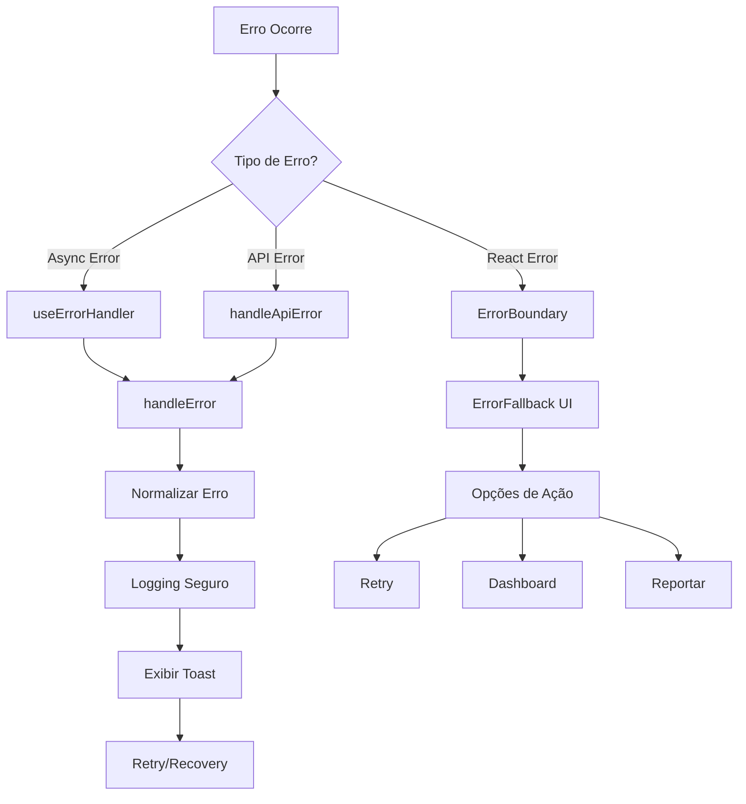

# Sistema de Tratamento de Erros - ObrasAI

## 📋 Visão Geral

Este documento descreve o sistema completo de tratamento de erros implementado no ObrasAI. O sistema foi projetado para fornecer uma experiência de usuário consistente, logging robusto e facilidade de manutenção.

## 🏗️ Arquitetura do Sistema

### Componentes Principais

```
src/
├── components/error/
│   ├── ErrorBoundary.tsx      # Componente para capturar erros React
│   ├── ErrorFallback.tsx      # UI de fallback para erros
│   ├── index.ts               # Exports dos componentes
│   └── __tests__/             # Testes do sistema
├── hooks/
│   └── useErrorHandler.ts     # Hook principal para tratamento
├── types/
│   └── error.ts               # Tipos e interfaces TypeScript
├── config/
│   └── errorConfig.ts         # Configurações globais
├── lib/
│   └── errorSystem.ts         # Ponto de entrada principal
└── docs/
    ├── ERROR_HANDLING_GUIDE.md
    └── ERROR_HANDLING_MIGRATION_GUIDE.md
```

### Fluxo de Tratamento de Erros



## 🚀 Início Rápido

### 1. Importação Básica

```typescript
import { useErrorHandler, ErrorBoundary } from '@/lib/errorSystem';
```

### 2. Uso em Componentes

```typescript
function MyComponent() {
  const { handleError, handleApiError, wrapAsync } = useErrorHandler();
  
  const fetchData = wrapAsync(async () => {
    const response = await api.getData();
    return response;
  }, {
    context: 'fetch-user-data',
    fallbackMessage: 'Erro ao carregar dados'
  });
  
  return (
    <ErrorBoundary>
      <div>
        <button onClick={fetchData}>
          Carregar Dados
        </button>
      </div>
    </ErrorBoundary>
  );
}
```

### 3. Tratamento de Erros de API

```typescript
const { handleApiError } = useErrorHandler();

try {
  await api.createUser(userData);
} catch (error) {
  handleApiError(error, {
    context: 'create-user',
    fallbackMessage: 'Erro ao criar usuário'
  });
}
```

## 📚 Guias Detalhados

### [📖 Guia de Uso Completo](./docs/ERROR_HANDLING_GUIDE.md)
Documentação completa sobre como usar todos os recursos do sistema.

### [🔄 Guia de Migração](./docs/ERROR_HANDLING_MIGRATION_GUIDE.md)
Como migrar componentes existentes para o novo sistema.

## 🎯 Funcionalidades Principais

### ✅ Tratamento Robusto
- **Error Boundaries**: Captura erros em componentes React
- **Async Error Handling**: Tratamento de erros em operações assíncronas
- **Type-Safe**: Totalmente tipado com TypeScript
- **Retry Logic**: Sistema inteligente de retry com backoff

### 🔍 Logging Avançado
- **Logging Seguro**: Remove dados sensíveis automaticamente
- **Contexto Rico**: Inclui informações detalhadas para debugging
- **Ambientes**: Configurações diferentes para dev/prod
- **Structured Logging**: Logs estruturados para análise

### 🎨 UX Consistente
- **Fallback UI**: Interfaces amigáveis para erros
- **Toast Notifications**: Feedback imediato ao usuário
- **Recovery Options**: Opções claras de recuperação
- **Progressive Disclosure**: Detalhes técnicos apenas quando necessário

### ⚙️ Configuração Flexível
- **Configuração Global**: Personalização centralizada
- **Mensagens Customizadas**: Mensagens específicas por contexto
- **Retry Policies**: Políticas de retry por tipo de erro
- **Environment-Aware**: Comportamento adaptado ao ambiente

## 🔧 Configuração

### Configuração Básica

```typescript
// src/config/errorConfig.ts
export const errorConfig = {
  logging: {
    level: 'error',
    includeStackTrace: isDevelopment,
    console: isDevelopment,
  },
  toast: {
    duration: 6000,
    position: 'top-right',
    maxToasts: 3,
  },
  retry: {
    maxAttempts: 3,
    baseDelay: 1500,
    backoffMultiplier: 2,
  },
};
```

### Mensagens Personalizadas

```typescript
export const ERROR_MESSAGES = {
  AUTH: {
    UNAUTHORIZED: 'Você precisa fazer login.',
    FORBIDDEN: 'Sem permissão para esta ação.',
  },
  API: {
    NETWORK_ERROR: 'Erro de conexão.',
    SERVER_ERROR: 'Erro interno do servidor.',
  },
  // ... mais mensagens
};
```

## 🧪 Testes

### Executar Testes

```bash
npm test src/components/error/__tests__/
```

### Cobertura de Testes

- ✅ useErrorHandler hook
- ✅ ErrorBoundary component
- ✅ ErrorFallback component
- ✅ Integração com React Query
- ✅ Cenários de erro específicos
- ✅ Retry logic
- ✅ Logging seguro

## 📊 Tipos de Erro Suportados

### 🔐 Erros de Autenticação
```typescript
// 401 - Não autenticado
// 403 - Sem permissão
// Token expirado
// Credenciais inválidas
```

### 🌐 Erros de API
```typescript
// 400 - Bad Request
// 404 - Not Found
// 429 - Rate Limit
// 500 - Server Error
// Timeout
// Network Error
```

### ✏️ Erros de Validação
```typescript
// Campos obrigatórios
// Formato inválido
// Regras de negócio
// Validação de arquivo
```

### ⚠️ Erros Críticos
```typescript
// Falhas de sistema
// Corrupção de dados
// Problemas de segurança
// Crashes inesperados
```

## 🔒 Segurança

### Dados Sensíveis
O sistema automaticamente remove dados sensíveis dos logs:

```typescript
const SENSITIVE_FIELDS = [
  'password', 'token', 'secret', 'key',
  'authorization', 'cookie', 'session',
  'cpf', 'cnpj', 'phone'
];
```

### Logging Seguro
```typescript
// ❌ Nunca logado
const userData = {
  name: 'João',
  password: 'secret123', // Será [REDACTED]
  token: 'abc123'        // Será [REDACTED]
};

// ✅ Logado com segurança
const sanitized = sanitizeData(userData);
// { name: 'João', password: '[REDACTED]', token: '[REDACTED]' }
```

## 📈 Monitoramento

### Métricas Importantes
- **Error Rate**: Taxa de erros por endpoint
- **Recovery Rate**: Taxa de recuperação após erro
- **User Impact**: Impacto na experiência do usuário
- **Performance**: Tempo de resposta do sistema de erro

### Alertas
- **Erros Críticos**: Notificação imediata
- **Spike de Erros**: Aumento anormal na taxa de erro
- **Falhas de Recovery**: Falhas no sistema de recuperação

## 🛠️ Desenvolvimento

### Adicionando Novos Tipos de Erro

1. **Definir o tipo** em `src/types/error.ts`
2. **Criar a classe** de erro específica
3. **Adicionar mensagens** em `errorConfig.ts`
4. **Implementar tratamento** no `useErrorHandler`
5. **Adicionar testes** correspondentes

### Exemplo: Novo Tipo de Erro

```typescript
// 1. Tipo
export type ErrorType = 'generic' | 'api' | 'validation' | 'auth' | 'payment';

// 2. Classe
export class PaymentError extends Error {
  constructor(
    message: string,
    public readonly code: string,
    public readonly amount?: number
  ) {
    super(message);
    this.name = 'PaymentError';
  }
}

// 3. Mensagens
ERROR_MESSAGES.PAYMENT = {
  INSUFFICIENT_FUNDS: 'Saldo insuficiente',
  CARD_DECLINED: 'Cartão recusado',
};

// 4. Tratamento
handlePaymentError(error: unknown, context: string) {
  // Lógica específica para erros de pagamento
}
```

## 🤝 Contribuição

### Diretrizes
1. **Testes**: Todo novo código deve ter testes
2. **Documentação**: Atualizar documentação relevante
3. **Tipos**: Manter tipagem TypeScript rigorosa
4. **Segurança**: Nunca logar dados sensíveis
5. **UX**: Priorizar experiência do usuário

### Checklist de PR
- [ ] Testes adicionados/atualizados
- [ ] Documentação atualizada
- [ ] Tipos TypeScript corretos
- [ ] Sem dados sensíveis em logs
- [ ] Mensagens de erro amigáveis
- [ ] Compatibilidade com configuração existente

## 📞 Suporte

### Problemas Comuns

**Q: Erros não estão sendo capturados**
```typescript
// ✅ Certifique-se de usar ErrorBoundary
<ErrorBoundary>
  <MyComponent />
</ErrorBoundary>

// ✅ Use wrapAsync para funções assíncronas
const safeFunction = wrapAsync(asyncFunction, options);
```

**Q: Logs não aparecem em produção**
```typescript
// ✅ Verifique a configuração de ambiente
const config = {
  logging: {
    console: process.env.NODE_ENV === 'development',
    endpoint: process.env.REACT_APP_ERROR_ENDPOINT
  }
};
```

**Q: Muitos toasts sendo exibidos**
```typescript
// ✅ Configure throttling
const config = {
  toast: {
    maxToasts: 3,
    duration: 5000
  }
};
```

### Contato
- **Documentação**: Consulte os guias em `/docs`
- **Issues**: Abra uma issue no repositório
- **Dúvidas**: Entre em contato com a equipe de desenvolvimento

---

## 📝 Changelog

### v1.0.0 (2024-01-XX)
- ✨ Sistema completo de tratamento de erros
- 🎯 ErrorBoundary e ErrorFallback components
- 🔧 useErrorHandler hook
- 📊 Logging estruturado e seguro
- ⚙️ Configuração flexível
- 🧪 Suite completa de testes
- 📚 Documentação abrangente
- 🔄 Guias de migração
- 🎨 UI/UX consistente
- 🔒 Tratamento seguro de dados sensíveis

---

**Sistema de Tratamento de Erros ObrasAI** - Desenvolvido com ❤️ para uma melhor experiência de usuário.