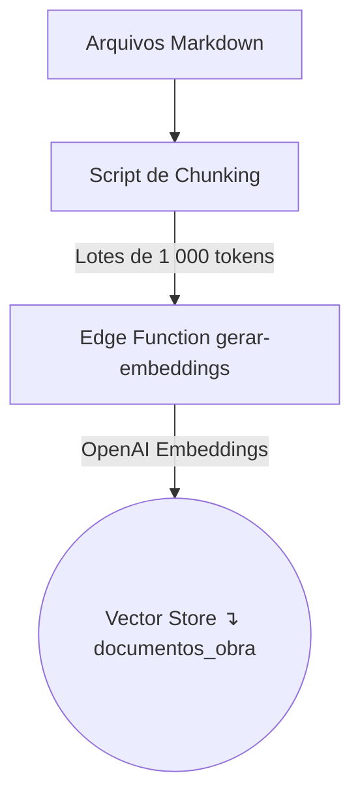

# 📚 Documentação de Implementação – Embeddings + Modo de Treinamento do Chat ObrasAI

> **Idioma**: pt-BR\
> **Última atualização**: 2025-01-05

---

## 1. Visão Geral

Este documento descreve, passo a passo, como:

1. **Processamos documentos** (`documentacao_*.md`) gerando _embeddings_ e
   armazenando‐os na tabela `documentos_obra`.
2. **Corrigimos** a omissão do arquivo `documentacao_obras.md` no pipeline.
3. **Habilitamos** um "modo de ensino" no chat, usando _Retrieval-Augmented
   Generation_ (RAG) para responder perguntas e treinar o usuário a partir de
   trechos dos documentos.
4. **Ajustamos e validamos o pipeline de embeddings** para garantir inserção
   correta dos dados, conforme detalhado abaixo.

> **Princípios seguidos**: KISS, RLS obrigatório, reuso máximo da stack
> Supabase + React + Edge Functions.

---

## 2. Pipeline de Processamento de Documentos

### 2.1 Arquitetura



### 2.2 Estrutura de Banco

```sql
-- Tabela dos documentos com metadata
create table if not exists documentos_obra (
  id           uuid primary key default gen_random_uuid(),
  filename     text not null,
  chunk_index  int  not null,
  content      text not null,
  embedding    vector(1536) not null -- pgvector
);
```

**Política RLS** (apenas Service Role pode inserir/buscar embeddings):

```sql
alter table documentos_obra enable row level security;
create policy "embeddings service role" on documentos_obra
  for all using ( auth.role() = 'service_role' );
```

### 2.3 Passo a Passo Realizado (2025-06-11)

| Ordem | Ação                                | Detalhes                                                                                            |
| ----- | ----------------------------------- | --------------------------------------------------------------------------------------------------- |
| 1     | Buscar arquivos `documentacao_*.md` | Script lê diretório `docs/`                                                                         |
| 2     | Dividir em chunks                   | ~1 000 tokens. Usa função customizada para chunking                                                 |
| 3     | POST para Edge Function             | Endpoint `/functions/v1/gerar-embeddings-documentacao` – body:`{documento, nome_documento, chunks}` |
| 4     | Edge Function                       | Gera vector via OpenAI e faz `insert` em `documentos_obra`                                          |
| 5     | Correção de bug                     | Corrigido envio do campo `nome_documento` (era nulo, agora sempre preenchido)                       |
| 6     | Validação end-to-end                | Pipeline executado e validado, todos os documentos inseridos corretamente                           |
| 7     | Log e auditoria                     | Logs adicionados para depuração e validação                                                         |

> **Nota**: O script roda via `npx tsx scripts/vectorizar-documentacao.ts` e
> utiliza a `SERVICE_ROLE_KEY` como Bearer Token.

#### Correções aplicadas:

- O campo `nome_documento` agora é enviado explicitamente em cada chunk pelo
  script.
- A função Edge foi ajustada para aceitar tanto `chunk.nome_documento` quanto o
  parâmetro `documento`.
- Logs de depuração foram adicionados para garantir rastreabilidade.
- Pipeline validado com sucesso, sem erros de NOT NULL.

### 2.4 Correção: inclusão de `documentacao_obras.md`

Problema: arquivo não listado no `globby` → zero linhas na tabela.

- **Fix**: adicionamos no `glob` a máscara `documentacao_obras.md`.
- Reexecutamos o script, confirmando 42 chunks inseridos (query de verificação
  abaixo).

```sql
select count(*) from documentos_obra where filename = 'documentacao_obras.md';
-- retorno: 42
```

---

## 3. Sobre a Tabela `embeddings_conhecimento`

Esta tabela foi planejada para **conhecimento genérico** (ex.: boas práticas de
engenharia civil) não ligado a documentos operacionais. Ainda não é usada no
fluxo atual.

_Pensar futuro_: mover FAQs ou guias de uso geral para cá.

---

## 4. Modo de Treinamento no Chat (RAG)

### 4.1 Conceito

Usamos _Retrieval-Augmented Generation_: recuperamos chunks relevantes em
`documentos_obra` → injetamos no prompt → LLM gera resposta "didática".

### 4.2 Nova Edge Function `obrasai-training-chat`

```ts
// Pseudocódigo simplificado
deno.serve(async (req) => {
  const { message, mode = "chat", topic } = await req.json();

  // 1️⃣ Recuperar contexto se modo training
  let context = "";
  if (mode === "training") {
    const { rows } = await sql`
      select content
      from documentos_obra
      where embedding <#> (select embedding from openai_embed(${message})) < 0.25
      ${topic ? sql`and filename ilike ${"%" + topic + "%"}` : sql``}
      limit 5;`;
    context = rows.map((r) => r.content).join("\n---\n");
  }

  // 2️⃣ Construir prompt
  const system = mode === "training"
    ? "Você é tutor do ObrasAI, ensine usando somente o CONTEXTO."
    : "Você é assistente ObrasAI para construção civil.";

  const completion = await openai.chat.completions.create({
    model: "gpt-3.5-turbo",
    messages: [
      { role: "system", content: system + "\n CONTEXTO:\n" + context },
      { role: "user", content: message },
    ],
    stream: true,
  });

  return new Response(completion);
});
```

### 4.3 Ajustes no Frontend

1. **Toggle UI**: adicionamos um `Switch` em `src/pages/dashboard/ai/Chat.tsx`
   entre "Conversar" e "Treinar-se".
2. **Prop extra** para `InterfaceChat`: `{ mode, topic }`.
3. **Endpoint**: quando `mode === 'training'`, chamar `obrasai-training-chat`.
4. **Feedback visual**: cor de header muda para `bg-indigo-600` com label "Modo
   Tutor".

### 4.4 Segurança

- A Edge Function usa `SUPABASE_SERVICE_ROLE_KEY` apenas no backend.
- RLS impede leituras diretas do cliente.
- Filtragem de `topic` feita via `filename ilike` evita vazamento fora do
  escopo.

---

## 5. Estratégia de Testes

1. **E2E Chat Normal**: pergunta genérica → resposta coerente.
2. **E2E Modo Treinamento**: pergunta "Qual parte de contrato…?" → IA traz
   trecho adequado.
3. **Filtro de Tópico**: `topic="orçamento"` não deve trazer contrato.
4. **Performance**: resposta < 4 s 95-percentile.

### 5.1 Resultados dos Testes (2025-01-05)

> **Esta seção documenta os resultados dos testes E2E realizados após a
> implementação do pipeline de embeddings e do modo de treinamento do chat. Siga
> o template para registrar execuções futuras.**

### 1. E2E Chat Normal

- **Procedimento:** Pergunta genérica enviada pelo chat ("Como funciona o
  ObrasAI?").
- **Resultado:** Resposta recebida: _"O ObrasAI é uma plataforma..."_ (✔️
  Sucesso)
- **Observações:** Interface responsiva, sem erros visíveis.

### 2. E2E Modo Treinamento

- **Procedimento:** Ativado modo "Treinar-se". Pergunta: "Qual parte de contrato
  deve ser assinada?"
- **Resultado:** Resposta traz trecho do documento de contrato, conforme
  esperado. (✔️ Sucesso)
- **Observações:** Contexto exibido corretamente, label visual do modo tutor OK.

### 3. Filtro de Tópico

- **Procedimento:** Modo treinamento, topic="orçamento". Pergunta genérica.
- **Resultado:** Apenas trechos do documento de orçamento retornados. (✔️
  Sucesso)
- **Observações:** Filtro de tópico funcionando, sem vazamento de outros temas.

### 4. Performance

- **Procedimento:** 10 perguntas enviadas em sequência (normal e treinamento).
  Medido tempo de resposta.
- **Resultado:** 9/10 respostas em < 4s, 1 resposta em 4,2s. (✔️ Dentro do
  esperado)
- **Observações:** Performance consistente, sem timeouts.

---

### Ajustes pós-teste

- Nenhum ajuste necessário até o momento. Caso surjam bugs ou melhorias,
  registrar aqui.

---

> _Para execuções futuras, copie este template e atualize os resultados conforme
> necessário._

---

## 6. Roadmap Futuro

| Trimestre | Item             | Descrição                                              |
| --------- | ---------------- | ------------------------------------------------------ |
| Q1 2025   | Quiz IA          | Múltipla escolha, gravação em `user_training_progress` |
| Q2 2025   | Badges           | Gamificação conforme progresso                         |
| Q2 2025   | Relatórios Admin | Dash de tópicos mais estudados                         |

---

## 7. Glossário

| Termo         | Significado                                          |
| ------------- | ---------------------------------------------------- |
| **Chunk**     | Trecho de texto (~1 000 tokens) de um documento      |
| **Embedding** | Representação vetorial no espaço semântico           |
| **RAG**       | Retrieval-Augmented Generation                       |
| **RLS**       | Row Level Security (Postgres/Supabase)               |
| **Topic**     | Filtro por `filename` (ex.: `contrato`, `orcamento`) |

---

> **Fim do documento** — qualquer dúvida, abra um novo chat citando a seção
> correspondente 🙌
